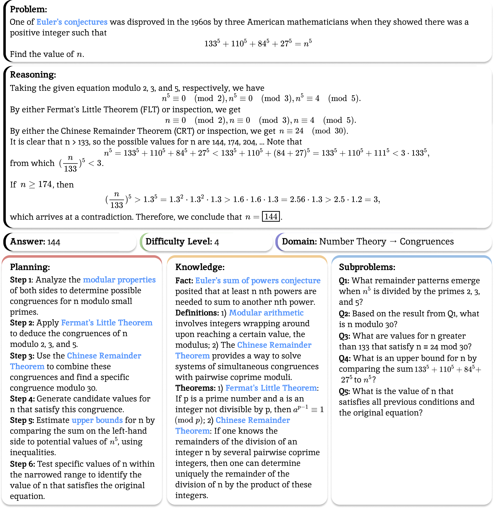

#  SPARKLE: Beyond Accuracy: Dissecting Mathematical Reasoning for LLMs Under Reinforcement Learning

<div align="center">

[](https://arxiv.org/abs/2506.04723)
[](https://sparkle-reasoning.github.io/)
[](https://huggingface.co/sparkle-reasoning/models)
[](https://huggingface.co/sparkle-reasoning/datasets)
[](LICENSE)

</div>

<div align="center">



</div>

**SPARKLE** is a fine-grained framework for evaluating LLM reasoning improvements under reinforcement learning (RL), analyzing models along three key axes: **plan-following and execution**, **knowledge utilization**, and **subproblem decomposition**. We also study difficulty, and our work reveals that hard problems remain valuable for RL training when appropriately structured with partial solution steps.

## 🔥 Key Insights

### 💡 **Hard Problems Are Still Valuable**
Contrary to common belief, hard problems can be effective for RL training when **augmented with partial solution steps**. Our curriculum-style approach shows that continuing training on the hardest problems—augmented with partial solutions—leads to the best performance.

### 💡 **RL Enhances Internal Strategy Formation**
RL-tuned models don't just execute external plans better—they **formulate and follow internal strategies** better suited to their reasoning processes. Providing explicit step-by-step plans surprisingly degrades performance on challenging benchmarks, but RL models show greater robustness.

### 💡 **Better Knowledge Integration**
RL significantly enhances the model's capacity to **integrate provided knowledge** into its reasoning process, leading to consistent performance improvements across diverse mathematical tasks and difficulty levels.

## 📊 Results

| Model                       | AIME               | AMC                | MATH500            | GSM8K              | OlympiadBench           | Avg.      |
| --------------------------- | ------------------ | ------------------ | ------------------ | ------------------ | ------------------ | --------- |
| Qwen-2.5-Math-7B-Base       | 16.67              | 42.50              | 44.03              | 42.53              | 28.65              | 35.23     |
| SparkleRL-Stage 1           | 46.67 (↑30.00)     | 67.50 (↑25.00)     | 80.00 (↑35.97)     | 91.77 (↑49.24)     | 39.11 (↑10.46)     | 65.01     |
| **SparkleRL-Stage 2 (Aug)** | **50.42** (↑33.75) | **71.25** (↑28.75) | **81.00** (↑36.97) | 92.38 (↑49.85)     | **40.11** (↑11.46) | **67.03** |

*Table: Avg@8 performance across benchmarks. Stage 2 (Aug) uses our curriculum-style training with augmented hard problems.*

## 🚀 Quick Start

### Installation

```bash
# Create and activate conda environment
conda create -n sparkle python==3.12
conda activate sparkle

# Install PyTorch and Flash Attention
pip3 install torch==2.4.0 
pip3 install flash-attn --no-build-isolation

# Install VERL and dependencies
cd verl
pip3 install -e .
pip install wandb IPython matplotlib
pip install vertexai latex2sympy2
pip3 install -U antlr4-python3-runtime==4.9.3
```

### Prepare Datasets

```bash
# Generate parquet files in data/*.parquet
python scripts/data/prepare_stage_one_data.py
python scripts/data/prepare_stage_two_data.py --aug_version all  # Recommended based on our ablation studies
```

### Training

```bash
# Set XFormers backend to avoid CUDA errors
export VLLM_ATTENTION_BACKEND=XFORMERS

# Stage 1: Foundation RL training on full dataset
export PATH_TO_BASE_MODEL="Qwen/Qwen2.5-Math-7B"
./scripts/train/stage_one.sh --model $PATH_TO_BASE_MODEL

# Stage 2: Curriculum-style training with augmented hard problems (recommended)
export PATH_TO_STAGE_ONE_MODEL="/path/to/your/stage1/checkpoint"
./scripts/train/stage_two_aug.sh --model $PATH_TO_STAGE_ONE_MODEL
```

> **Note**: Stage 2 training uses the `spk_h_aug` reward type which handles augmented responses with partial format. This is crucial for the curriculum-style training approach.

### Evaluation

```bash
# Step 1: Convert FSDP checkpoint to HuggingFace format (if using your own checkpoints)
python eval/fsdp2hf.py \
    --fsdp_path /path/to/checkpoint/actor \
    --base_model Qwen/Qwen2.5-Math-7B \
    --output_path /path/to/output

# Step 2: Set up evaluation environment
cd eval/lm-evaluation-harness
pip install -e .

# Step 3: Run comprehensive evaluation across all benchmarks
export PATH_TO_STAGE_ONE_MODEL="/path/to/stage1/model"
export PATH_TO_STAGE_TWO_MODEL="/path/to/stage2/model"
./scripts/eval/eval_all_vllm.sh
```

> **Tip**: You can also directly use our pre-trained checkpoints from HuggingFace instead of converting your own FSDP checkpoints.

## 🤗 Model Checkpoints

We release our checkpoints on [HuggingFace](https://huggingface.co/sparkle-reasoning/models):

- [`sparkle-reasoning/SparkleRL-7B-Stage1`](https://huggingface.co/sparkle-reasoning/SparkleRL-7B-Stage1) - Foundation RL-tuned model trained with the large-scale full dataset
- [`sparkle-reasoning/SparkleRL-7B-Stage2-aug`](https://huggingface.co/sparkle-reasoning/SparkleRL-7B-Stage2-aug) - **Recommended**: Curriculum-style training with a small amount of augmented hard problems
- [`sparkle-reasoning/SparkleRL-7B-Stage2-hard`](https://huggingface.co/sparkle-reasoning/SparkleRL-7B-Stage2-hard) - Training on hard problems only
- [`sparkle-reasoning/SparkleRL-7B-Stage2-mix`](https://huggingface.co/sparkle-reasoning/SparkleRL-7B-Stage2-mix) - Mixed difficulty training

## 📚 Datasets

Our curated datasets are available on [HuggingFace](https://huggingface.co/sparkle-reasoning/datasets):

### Training Data
- [`sparkle-reasoning/dsr40k`](https://huggingface.co/datasets/sparkle-reasoning/dsr40k) - Large-scale training data (40.3k problems) used for stage one foundation training
- [`sparkle-reasoning/hardmath`](https://huggingface.co/datasets/sparkle-reasoning/hardmath) - Challenging mathematical problems (6.5k problems) used for stage two curriculum training, specifically questions that the stage one model cannot answer, with rigorous data label cleaning

### Evaluation Benchmarks
- AIME 2024, AMC 2023, MATH500, GSM8K, OlympiadBench - Standard mathematical reasoning evaluation sets

## 🏗️ Framework Overview

The SPARKLE framework evaluates mathematical reasoning along three dimensions:

1. **Plan-Following and Execution**: How well models follow and execute reasoning plans
2. **Knowledge Utilization**: Ability to integrate external knowledge into reasoning
3. **Subproblem Decomposition**: Capacity to solve decomposed subproblems

### Curriculum-Style Training

Our key innovation is a two-stage curriculum approach:

1. **Stage 1**: Train on the full dataset to build a strong foundation
2. **Stage 2**: Continue training on the hardest problems augmented with partial solution steps

#### Example: Augmented Hard Problem

**🔵 Original Problem:**
> One of Euler's conjectures was disproved in the 1960s by three American mathematicians when they showed there was a positive integer such that: 133⁵ + 110⁵ + 84⁵ + 27⁵ = n⁵. Find the value of n.

**🎯 Augmented with Partial Solution:**
> One of Euler's conjectures was disproved in the 1960s by three American mathematicians when they showed there was a positive integer such that: 133⁵ + 110⁵ + 84⁵ + 27⁵ = n⁵. Find the value of n.
>
> Taking the given equation modulo 2, 3, and 5, respectively, we have:
> n⁵ ≡ 0 (mod 2), n⁵ ≡ 0 (mod 3), n⁵ ≡ 4 (mod 5)

## 🔧 TODOs

- [ ] Release test sets - ETA by July 13, 2025
- [ ] Provide additional evaluation scripts for fine-grained analysis

## 🐛 Issues & Support

If you encounter any problems, have questions, or would like to contribute to the project, please feel free to:

- **Open an issue** on our GitHub repository
- **Contact us directly** at [milawang@cs.wisc.edu](mailto:milawang@cs.wisc.edu)

We welcome contributions, bug reports, and feature requests from the community!

## 📖 Citation

If you find this work useful, please consider citing:

```bibtex
@misc{wang2025accuracydissectingmathematicalreasoning,
    title={Beyond Accuracy: Dissecting Mathematical Reasoning for LLMs Under Reinforcement Learning}, 
    author={Jiayu Wang and Yifei Ming and Zixuan Ke and Caiming Xiong and Shafiq Joty and Aws Albarghouthi and Frederic Sala},
    year={2025},
    eprint={2506.04723},
    archivePrefix={arXiv},
    primaryClass={cs.AI},
    url={https://arxiv.org/abs/2506.04723}, 
}
```

## 📄 License

This project is licensed under the MIT License - see the [LICENSE](LICENSE) file for details.

## 🔗 Links

- 📄 **Paper**: [Beyond Accuracy: Dissecting Mathematical Reasoning for LLMs Under Reinforcement Learning](https://arxiv.org/abs/2506.04723)
- 🌐 **Project Page**: [https://sparkle-reasoning.github.io/](https://sparkle-reasoning.github.io/)
- 🤗 **Models**: [https://huggingface.co/sparkle-reasoning/models](https://huggingface.co/sparkle-reasoning/models)
- 🤗 **Datasets**: [https://huggingface.co/sparkle-reasoning/datasets](https://huggingface.co/sparkle-reasoning/datasets)